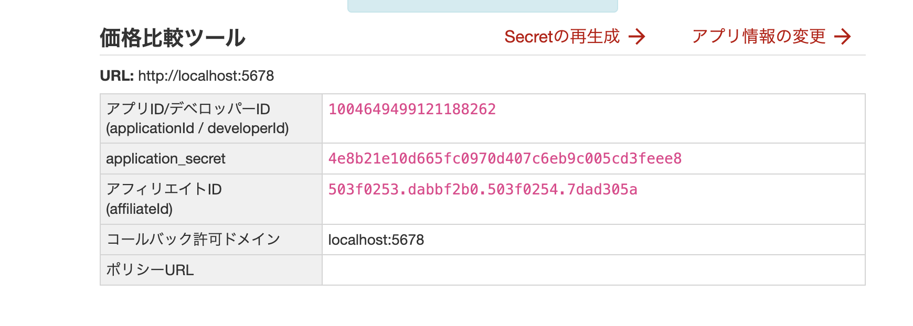

# n8n 設定ガイド：楽天API & Google Sheets

## 1. 楽天アプリIDの取得

### 手順

1. **[楽天Webサービス](https://webservice.rakuten.co.jp/)** にアクセス
2. 右上の **「ログイン」** をクリック（楽天会員IDでログイン）
3. ヘッダーの **「+ アプリID発行」** をクリック
4. アプリ情報を入力：
   - **アプリ名**: 任意（例：価格比較ツール）
   - **アプリURL**: `http://localhost:5678`（ローカル用）
5. 発行された **アプリID** をメモ



---

## 2. Google Sheets IDの取得

### 手順

1. [Google Sheets](https://sheets.google.com) で新規スプレッドシートを作成
2. シート名を **「価格比較結果」** に変更
3. URLからスプレッドシートIDをコピー：

```
https://docs.google.com/spreadsheets/d/【この部分がID】/edit
```

**例:**
```
https://docs.google.com/spreadsheets/d/1aBcDeFgHiJkLmNoPqRsTuVwXyZ/edit
                                       ↑
                                  この部分をコピー
```

---

## 3. n8nでの設定方法

### 3.1 ワークフローをインポート

1. n8n（http://localhost:5678）にログイン
2. **Workflows** → **Import from File**
3. `rakuten_price_comparison.json` を選択

### 3.2 楽天アプリIDを設定

1. **「🔧 検索パラメータ設定」** ノードをダブルクリック
2. `applicationId` の値を変更：
   ```
   YOUR_RAKUTEN_APP_ID → 取得したアプリID
   ```

### 3.3 Google Sheets IDを設定

1. **「📝 Google Sheets出力」** ノードをダブルクリック
2. `documentId` の値を変更：
   ```
   YOUR_GOOGLE_SHEET_ID → 取得したスプレッドシートID
   ```

### 3.4 Google Sheets認証を設定

1. 📝ノードで **Credential** の「Create New」をクリック
2. **Google Sheets OAuth2** を選択
3. [Google Cloud Console](https://console.cloud.google.com/) で：
   - プロジェクト作成
   - **Google Sheets API** を有効化
   - **OAuth 2.0 クライアントID** を作成
   - リダイレクトURI: `http://localhost:5678/rest/oauth2-credential/callback`
4. Client ID と Client Secret を n8n に入力
5. 「Sign in with Google」で認証

---

## 4. 動作テスト

1. ワークフロー画面で **「Execute Workflow」** ボタンをクリック
2. 各ノードの出力を確認
3. Google Sheetsに結果が書き込まれていれば成功！

---

## トラブルシューティング

| 問題 | 対処法 |
|-----|-------|
| 楽天APIエラー | アプリIDが正しいか確認 |
| Google認証エラー | OAuth設定を再確認、リダイレクトURIが正しいか確認 |
| データが空 | 検索キーワードを調整 |
